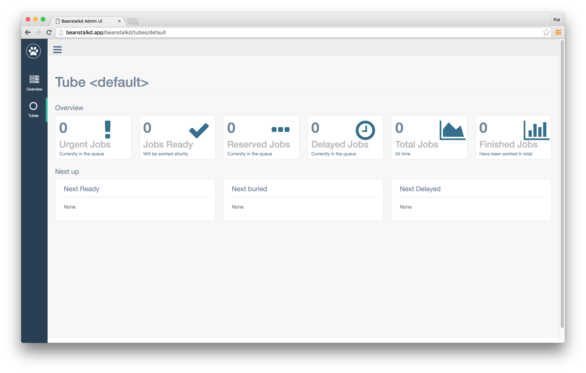

# Laravel Beanstalkd Admin UI

[](https://codeclimate.com/github/ksassnowski/laravel-beanstalkd-admin-ui)
[](https://img.shields.io/badge/version-3.1.0-blue.svg)
[](https://img.shields.io/badge/license-MIT-blue.svg)



:fire: A slick Admin Interface for monitoring your Beanstalkd queues right out of your Laravel application. :fire:

## Installation

Require the package through composer

```
composer require dionera/laravel-beanstalkd-ui
```

### Version Table

| Laravel | Required PHP Version | Package Version |
|:--------|:----|:--------|
| `^5.7.28` | `^7.2` | `^2.0` |
| `^6.0`, `^7.0` | `^7.2` | `^2.1` |
| `^7.0` | `^7.4` | `^3.0` |
| `^7.0`, `^8.0` | `^7.4` | `^3.1` |

### Publish assets

Next we need to publish the package's assets. We do this by running the following command:

```
php artisan vendor:publish --provider="Dionera\BeanstalkdUI\BeanstalkdUIServiceProvider" --tag="public"
```

This will publish all the required Javascript and CSS into your applications `public/vendor/beanstalkdui` folder.

### View it in the browser

Now navigate to `http://<your-app>/beanstalkd/tubes` in your browser. If you're not already authenticated you will now be asked to log in. This is because by
default all routes use the `auth` middleware. See the [Configuration](#configuration) section for information about how to overwrite this.

## Live Updating


## Configuration

In order to overwrite the default configuration we first need to publish the package's config file.

```
php artisan vendor:publish --provider="Dionera\BeanstalkdUI\BeanstalkdUIServiceProvider" --tag="config"
```

This will place a `beanstalkdui.php` in your application's `config` folder. Inside you will find the following settings:

| Value | Default | Description |
|-------|--------|:---------|
| `host` | `'127.0.0.1'` | The Beanstalkd host. |
| `port` | `11300` | The Port Beanstalkd is running on. |
| `middleware` | `['web', 'auth']` | An array of middlewares which get applied to all the package's routes. If no middleware should be applied simply remove `auth` from the array. |
| `prefix` | '' | Route prefix that should be applied the Admin UI routes. |
| `failed_jobs` | `true` | Defines if you want to be able to also manage your failed jobs through the UI. If set to `true` an additional table containing all failed jobs for the current tube will be displayed. |
| `failed_jobs_table` | `failed_jobs` | The name of the table containing your failed jobs. |

